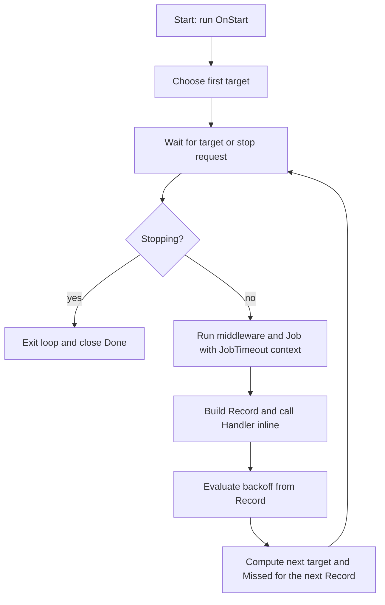

<p align="center">
  
</p>

<p align="center">
  <a href="https://github.com/uchaloop/beat/actions/workflows/ci.yml"></a>
  <a href="https://pkg.go.dev/github.com/uchaloop/beat"></a>
  <a href="LICENSE"></a>
</p>

Run one recurring job in a long-lived Go process. beat provides sequential
execution, fixed-rate or fixed-delay scheduling, replica offsets, cooperative
timeouts, and optional Fx integration. Requires Go 1.27 or later.

Use it for frequent polling and background work that benefits from reusable
connections and in-memory state. beat has no calendar expressions, persistent
schedule, replay after downtime, or coordination between replicas.

## Standalone example

```go
package main

import (
    "context"
    "log/slog"
    "os"
    "os/signal"
    "syscall"
    "time"

    "github.com/uchaloop/beat"
)

func main() {
    shutdown, cancel := signal.NotifyContext(context.Background(), os.Interrupt, syscall.SIGTERM)
    defer cancel()

    job := func(ctx context.Context) (int, error) {
        // Replace this timer with one bounded batch of application work.
        timer := time.NewTimer(20 * time.Millisecond)
        defer timer.Stop()
        select {
        case <-timer.C:
            return 1, nil
        case <-ctx.Done():
            return 0, ctx.Err()
        }
    }
    handler := beat.HandlerFunc(func(_ context.Context, r beat.Record) {
        slog.Info("job completed", "outcome", r.Outcome,
            "processed", r.Processed, "duration", r.Duration, "missed", r.Missed)
    })
    runner, err := beat.MakeBeat(beat.Config{
        Period: 5 * time.Second, JobTimeout: 2 * time.Second, Jitter: time.Second,
    }, job, handler, beat.WithGracefulStop())
    if err != nil {
        slog.Error("configure beat", "error", err)
        return
    }
    if err := runner.Start(shutdown); err != nil {
        slog.Error("start beat", "error", err)
        return
    }
    <-shutdown.Done()
    stopCtx, stopCancel := context.WithTimeout(context.Background(), 10*time.Second)
    defer stopCancel()
    if err := runner.Stop(stopCtx); err != nil {
        slog.Error("stop beat", "error", err)
    }
}
```

`Start`'s context applies to startup only. To stop a running Beat, call `Stop`
with a fresh context. A nil Handler is allowed.

## Scheduling

| Mode | First run | Following runs |
|---|---|---|
| `ModeFixedRate` (default) | Next grid point strictly after startup | Grid points `k × Period + offset`, anchored to the Unix epoch |
| `ModeFixedDelay` | Startup time + offset | At least `Period` after the previous Job returns |

A Beat never overlaps its Job calls. Fixed-rate runs that overrun grid points
move to the first available point; no backlog of runs is queued. A pending target
that is already past when the loop wakes runs once immediately, so the following
run may be close behind. A restart joins the grid afresh.

For example, with a 5-minute period, a 25-second offset and a 4m50s Job:

```text
Fixed rate:   10:00:25 ── Job ── 10:05:15   → next start 10:05:25
Fixed delay:  10:00:25 ── Job ── 10:05:15   → next start 10:10:15
```

### Run loop



`Duration` covers the Job and its middleware, excluding Handler and backoff.
The Handler and backoff callback still occupy the loop: keep both short.
Fixed-rate waits periodically recheck wall time; fixed-delay waits use monotonic
time. Neither mode is a real-time execution guarantee.

## Configuration and options

beat accepts a `Config`; it does not read environment variables itself. Its env
tags support loaders such as confmaker, with default instance name `beat`.

| Field | Default env name | Default | Constraint |
|---|---|---|---|
| `Period` | `BEAT_PERIOD` | Required | Greater than zero |
| `JobTimeout` | `BEAT_JOB_TIMEOUT` | `1m` | Zero selects the default; negative values are invalid |
| `Jitter` | `BEAT_JITTER` | `0` | Between zero and Period, inclusive |

The timeout cancels the Job's context; it cannot interrupt the function. Jobs
must respect cancellation and join their own goroutines before returning.
A Job that never returns blocks subsequent runs and completion records.

Options select the mode, offset, backoff, middleware, Handler and lifecycle
hooks. Repeated setter options use the last value; `WithMiddleware` appends
wrappers, with the first wrapper outermost. `WithHandler` overrides the Handler
passed to `MakeBeat`. `WithGracefulStop` enables draining on shutdown.

### Polling with backoff

With a short fixed-delay period, continue polling when a batch is full and rest
longer after an empty or partial batch:

```go
opts := []beat.Option{
    beat.WithMode(beat.ModeFixedDelay), // for example, Config.Period = 1s
    beat.WithBackoff(func(r beat.Record) time.Duration {
        if r.Outcome != beat.OutcomeOK {
            return 30 * time.Second
        }
        if r.Processed < 1000 {
            return 5 * time.Minute
        }
        return 0
    }),
}
```

Backoff is a minimum pause measured from Job completion, not an addition to
Period. In fixed-delay mode the next target is the latest of Job end + Period,
Job end + positive backoff, and the time scheduling resumes. In fixed-rate mode
it is the next eligible grid point no earlier than scheduling resumes or the
backoff permits. Returning zero or a negative value adds no restriction; it
does not remove Period. Deliberately bypassed backoff points are not Missed.

### Replica offsets

Jitter draws one offset in `[0, Jitter)` per Beat; zero gives no offset.
In fixed-rate mode it shifts every grid point. In fixed-delay mode it delays
only the first run. `Jitter == Period` permits spreading across the full period.
A wider range spreads planned starts but can increase initial waiting time.

To derive an offset from an application-provided identity:

```go
offset := beat.OffsetFor(service+"/"+cluster+"/"+instance, cfg.Jitter)
runner, err := beat.MakeBeat(cfg, job, handler, beat.WithOffset(offset))
```

`WithOffset` requires `0 <= offset < Period`. `OffsetFor` is stable only while
its input is stable; replacing a Deployment Pod usually changes its name.
Hashing and random draws do not guarantee gaps between replicas. Services may
share the same Jitter range.

Offsets spread starts; they do not divide work or prevent duplicate effects.
Queue claiming, retries and idempotency belong to the application, including
when consumers run in different clusters.

## Records and observability

A Handler receives one Record after each completed Job:

| Fields | Meaning |
|---|---|
| `Iteration`, `Mode`, `Period` | Run number and scheduling configuration |
| `ScheduledFor`, `Start`, `Duration` | Target, actual start and Job elapsed time |
| `Processed`, `Err` | Values returned by Job |
| `Outcome` | `ok`, `error`, `panic`, `timeout` or `canceled` |
| `Missed` | Unintentional grid losses computed after the preceding run |

Outcome is authoritative even if Err is nil. A recovered panic takes precedence,
then cancellation of the Job context (timeout or shutdown), then the Job's error.
Missed is zero in fixed-delay mode. It excludes intentional backoff and is
reported with the next completed Job, so a shutdown or a stuck Job may prevent
its delivery. The current Record's duration does not identify the cause of its
Missed count.

Handlers run inline with a context without cancellation or a deadline. Give any
I/O its own budget. `MultiHandler` calls sinks sequentially. For metrics, use
[otelbeat](https://github.com/uchaloop/otelbeat); the application owns its exporter.

## Lifecycle and shutdown

- Start may run once. Repeated Start returns `ErrAlreadyStarted`; a stopped
  Beat returns `ErrStopped` and cannot be restarted.
- Stop prevents further scheduling. Normally it cancels the active Job at once;
  `WithGracefulStop` lets it finish within Stop's budget. JobTimeout still applies.
- Concurrent Stop callers share the first Stop's result, but each waiting caller
  may return early if its own context expires.
- Stop waits for an in-progress OnStart. If OnStart fails, OnStop is not called;
  the startup hook must clean up partially acquired resources on failure.
- If OnStart succeeds but startup's context is cancelled, Start arranges OnStop
  with a fresh 15-second context unless a concurrent Stop already owns cleanup.
- If startup or the loop has not finished when Stop stops waiting, Stop returns
  `ErrStillRunning` joined with its context error. OnStop is skipped permanently.
- Otherwise OnStop runs synchronously after the loop exits. Hooks must respect
  their contexts; a blocked hook can outlive the supplied deadline.

`Done()` closes after startup/run-loop activity finishes, **before OnStop**.
Only use it for fallback cleanup after Stop reports ErrStillRunning. Bound any
additional wait according to the application's shutdown policy:

```go
if errors.Is(stopErr, beat.ErrStillRunning) {
    select {
    case <-runner.Done():
        // Startup and the loop have ended; perform application-owned cleanup.
    case <-cleanupCtx.Done():
        // Leave final termination to the process supervisor.
    }
}
```

## Fx and panic recovery

Supply a Config, Job, optional Handler, and at most one ordered `beatfx.Options`
value. Static options passed to Module come first, followed by container options:

```go
app := fx.New(
    fx.Supply(beat.Config{Period: time.Minute, JobTimeout: 45 * time.Second}),
    fx.Provide(func() beat.Job { return job }),
    fx.Provide(func(log *slog.Logger) beatfx.Options {
        return beatfx.Options{
            beat.WithMiddleware(recovery.Middleware(recovery.WithLogger(log))),
            beat.WithGracefulStop(),
        }
    }),
    fx.Supply(slog.Default()),
    beatfx.Module(),
    fx.StopTimeout(time.Minute),
)
app.Run()
```

Here `job` is the application's `beat.Job`. Import `beat/beatfx`,
`beat/middleware/recovery`, and `go.uber.org/fx` for this integration.
Use one beatfx Module per Fx application. Independent standalone Beat objects
have independent lifecycles.

Panics propagate by default. Recovery middleware catches panics only inside the
wrapped Job call and returns `*beat.PanicError`; it does not protect Handler,
backoff, hooks, or goroutines created by the Job.

[API reference](https://pkg.go.dev/github.com/uchaloop/beat) ·
[Compilable examples](example_test.go) · [MIT license](LICENSE)
